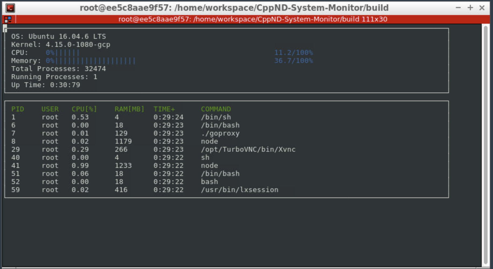

# CppND-System-Monitor Leda's Project

The final code written by Leda for System Monitor Project in the Object Oriented Programming Course of the [Udacity C++ Nanodegree Program]

My final system monitor looks like the image below. 

## How to use the System Moniter

1. [ncurses](https://www.gnu.org/software/ncurses/) is a library that facilitates text-based graphical output in the terminal. This project relies on ncurses for display output.

You can install ncurses within your own Linux environment: `sudo apt install libncurses5-dev libncursesw5-dev`

2. The excutable file is inside build folder.  Run the resulting executable: `./build/monitor`

3. If you want to build the project: `make build`

## Structure of the Code

Object-Oriented Programming is practiced intensively in this project. The concept of encapsulation, abstraction, inheritance and polymorphism are implemented. 

### Class Structure

The project consists mainly of 

1. System: A class contained all the system information, such as perating system, kernel version, memory utilization, total number of processes, number of running processes, and uptime. 

2. LinuxParser Namespace: A namespace that contains all the methods used to read in the information from the Linux system files. 

3. Processor: Return the CPU utilization. 

4. Process: Contain all the information for the processes running in the system, including RAM, CPU utilization, Uptime, and etc. 

5. NCursesDisplay: using ncurses for display text-based graphical output in the terminal.
